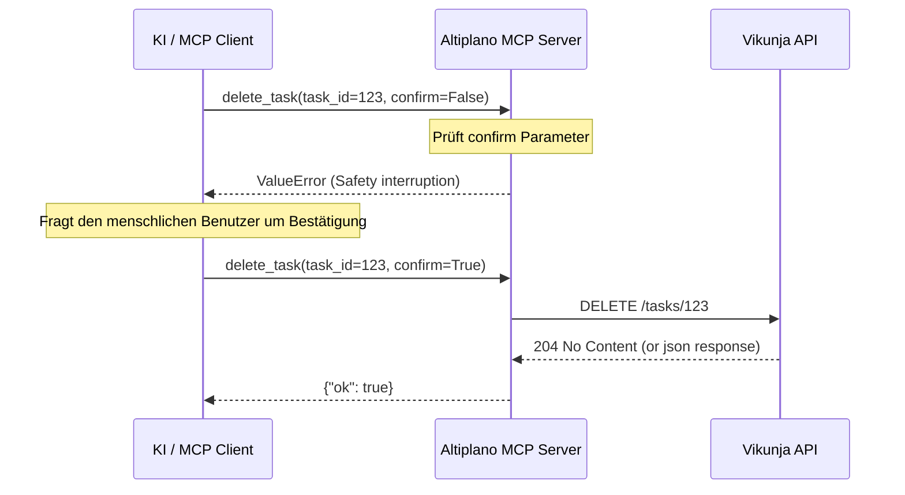

# Developer Notes: Allgemeines Löschen

## Überblick

Technisch gesehen implementiert das Feature drei zerstörerische `DELETE` Operationen der Vikunja-API als FastMCP-Tools. Alle Tools sind statuslos und erzwingen clientseitig (durch LLM-Interpretation eines `ValueError`) eine Bestätigung des menschlichen Benutzers.

## Referenzen

* Plan: [plan-v001.md](file:///e:/bjoer/Documents/repos/altiplano/docs/project/features/allgemeines-loeschen/plan-v001.md)
* PRD: [vikunja-mcp-server-v006.md](file:///e:/bjoer/Documents/repos/altiplano/docs/project/prds/vikunja-mcp-server-v006.md)

## Betroffene Dateien

| Datei | Zweck / Änderung |
|---|---|
| [src/altiplano/server.py](file:///e:/bjoer/Documents/repos/altiplano/src/altiplano/server.py) | Registrierung der MCP-Tools `delete_task`, `delete_bucket` und `delete_comment`. |
| [tests/test_server.py](file:///e:/bjoer/Documents/repos/altiplano/tests/test_server.py) | Unit-Tests für die neuen Lösch-Tools inklusive Validierung des `ValueError` bei fehlender Bestätigung. |
| [TASKS.md](file:///e:/bjoer/Documents/repos/altiplano/TASKS.md) | Feature als abgeschlossen markiert. |

## Architektur und Datenfluss

## Datenmodell und API-Mapping

* **Task löschen:** `DELETE /tasks/{task_id}`
* **Kommentar löschen:** `DELETE /tasks/{task_id}/comments/{comment_id}`
* **Kanban-Bucket löschen:**
  * Zuerst wird die `view_id` über die interne Hilfsfunktion `_resolve_kanban_view_id(project_id)` aufgelöst.
  * Anschließend erfolgt der API-Aufruf: `DELETE /projects/{project_id}/views/{view_id}/buckets/{bucket_id}`

## Validierung und Tests

Die Abdeckung wird durch Unit-Tests in [tests/test_server.py](file:///e:/bjoer/Documents/repos/altiplano/tests/test_server.py) sichergestellt.

| Prüfung | Befehl | Ergebnis / Hinweis |
|---|---|---|
| Unit- & Integrationstests | `uv run pytest` | 26/26 Tests erfolgreich (inklusive Mocks für alle `DELETE` Endpunkte und Fehlerszenarien). |
| MCP Initialisierungstest | `test_mcp_initialization` | Prüft, ob `delete_task`, `delete_comment` und `delete_bucket` korrekt als FastMCP-Tools registriert sind. |

## Betriebs- und Setup-Hinweise

* Keine neuen Umgebungsvariablen benötigt. Das Feature setzt auf der bestehenden Vikunja-API-Verbindung auf.

## Wartungshinweise

* **Gotcha:** Das Auflösen der `view_id` für Buckets erfordert, dass das Projekt bereits eine Kanban-Ansicht konfiguriert hat. Falls nicht, wirft `_resolve_kanban_view_id` eine Fehlermeldung.
* **Erweiterungen:** Zukünftige zerstörerische Operationen (z.B. Löschen von Labels oder Projekten) sollten demselben Bestätigungs-Pattern (`confirm: bool = False` mit `ValueError` bei `False`) folgen.
