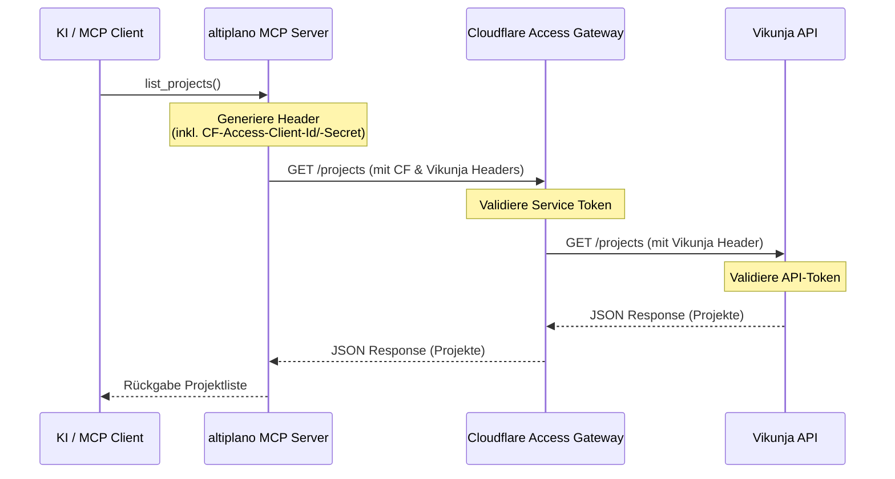

# Developer Notes: Cloudflare Access Support

## Überblick

Dieses Feature erweitert die HTTP-Header-Erstellung im MCP-Server, um optionale Authentifizierungsdaten für Cloudflare Access (Zero Trust) mitzusenden. Dies verhindert, dass HTTP-Anfragen an Vikunja-Instanzen mit einem `302 Found` Redirect auf die Cloudflare Access Login-Seite blockiert werden.

## Referenzen

- Plan: [plan-v001.md](file:///e:/bjoer/Documents/repos/altiplano/docs/project/features/cloudflare-service-token/plan-v001.md)
- PRD: [vikunja-mcp-server-v004.md](file:///e:/bjoer/Documents/repos/altiplano/docs/project/prds/vikunja-mcp-server-v004.md)
- Update-Summary: [vikunja-mcp-server-v003-to-v004-update.md](file:///e:/bjoer/Documents/repos/altiplano/docs/project/prd-updates/vikunja-mcp-server-v003-to-v004-update.md)

## Betroffene Dateien

| Datei | Zweck / Änderung |
|---|---|
| `src/altiplano/server.py` | Anpassung der Funktion `_headers()`. Auslesen von `CF_CLIENT_ID` und `CF_CLIENT_SECRET` via `_conf()`. Wenn vorhanden, werden sie als `CF-Access-Client-Id` und `CF-Access-Client-Secret` dem Header-Dictionary hinzugefügt. |
| `tests/test_server.py` | Neuer Testfall `test_cloudflare_headers()`, welcher die Header-Generierung mit und ohne Cloudflare-Zugangsdaten über Mocks validiert. |
| `README.md` | Dokumentation der neuen Konfigurationsvariablen. |

## Architektur und Datenfluss



## Datenmodell und API-Mapping

Die Funktion `_headers()` gibt nun folgende optionale Struktur zurück:

```python
{
    "Authorization": "Bearer <token>",
    "Content-Type": "application/json",
    "CF-Access-Client-Id": "<client_id>",         # Optional
    "CF-Access-Client-Secret": "<client_secret>"  # Optional
}
```

## Validierung und Tests

| Prüfung | Ergebnis / Hinweis |
|---|---|
| Automatischer Test | `test_cloudflare_headers()` prüft das korrekte Hinzufügen der Header bei Vorhandensein bzw. das Nichtvorhandensein bei Fehlen der Config-Werte. |
| Manuelle Prüfung | Erfolgreich getestet über MCP Inspector gegen `tasks.melbjo.win` mit konfigurierten Werten in `~/.config/altiplano/env`. |

## Betriebs- und Setup-Hinweise

* **Umgebungsvariablen / Config:** `CF_CLIENT_ID` und `CF_CLIENT_SECRET` können entweder in `~/.config/altiplano/env` hinterlegt oder direkt in der Shell/Launcher exportiert werden.
* **Dateiberechtigungen:** Die Config-Datei sollte mittels `chmod 600` abgesichert sein.

## Wartungshinweise

- Sollten in Zukunft weitere Middleware- oder Gateway-Authentifizierungen nötig sein (z.B. Authelia, Authentik), kann dieses Pattern in `_headers()` analog erweitert werden.
- Die Header-Keys sind statisch gemäss den offiziellen Cloudflare Zero Trust Spezifikationen definiert.
