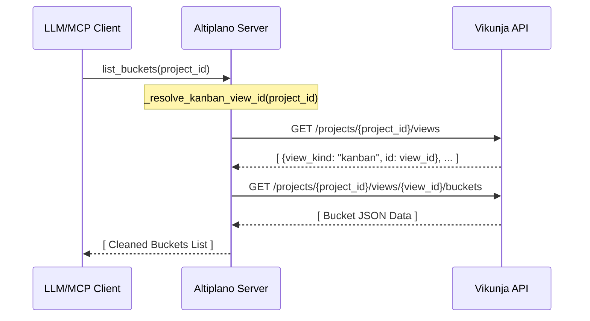

# Developer Notes: Kanban Buckets

## Überblick

Dieses Feature implementiert die Unterstützung für Kanban-Buckets (Spalten) im Altiplano MCP-Server. Die technische Herausforderung liegt darin, dass Vikunja Buckets an Projekt-Views und nicht direkt an Projekten aufhängt. Dieses Detail wird serverseitig verborgen, um die MCP-Tool-API so flach und benutzerfreundlich wie möglich zu halten.

## Referenzen

- Plan: `docs/project/features/kanban-buckets/plan-v001.md`
- PRD: `docs/project/prds/vikunja-mcp-server-v006.md`

## Betroffene Dateien

| Datei | Zweck / Änderung |
|---|---|
| `src/altiplano/server.py` | Hinzufügen des Helpers `_resolve_kanban_view_id` und der Tools `list_buckets`, `create_bucket`, `update_bucket`, `move_task_to_bucket`. |
| `tests/test_server.py` | Aktualisierung des Registrierungstests und Hinzufügen von Unit- und Integrationstests für alle neuen Tools und Fehlerszenarien. |

## Architektur und Datenfluss



## Datenmodell und API-Mapping

Die Bucket-Informationen von Vikunja werden auf ein minimiertes Set gemappt:

* **Vikunja-Felder -> MCP-Rückgabe (`list_buckets`):**
  * `id` -> `id`
  * `title` -> `title`
  * `limit` -> `limit` (Default `0` falls unbeschränkt)
  * `position` -> `position`
  * `count` -> `count`

* **Endpunkte:**
  * View-Auflösung: `GET /projects/{project_id}/views`
  * Buckets auflisten: `GET /projects/{project_id}/views/{view_id}/buckets`
  * Bucket erstellen: `PUT /projects/{project_id}/views/{view_id}/buckets`
  * Bucket bearbeiten: `POST /projects/{project_id}/views/{view_id}/buckets/{bucket_id}`
  * Task zuweisen: `POST /projects/{project_id}/views/{view_id}/buckets/{bucket_id}/tasks`

## Validierung und Tests

Die Abdeckung erfolgt über automatisierte Mocks in `tests/test_server.py`.

| Prüfung | Ergebnis / Hinweis |
|---|---|
| `test_mcp_initialization` | Prüft die ordnungsgemäße Registrierung der 4 neuen Tools auf dem FastMCP-Server. |
| `test_tool_list_buckets` | Validiert die Rückgabe-Transformation und den API-Aufruf (GET /projects/1/views & GET /projects/1/views/10/buckets). |
| `test_tool_create_bucket` | Prüft das Senden von Payload (`title`, `limit`) via `PUT`. |
| `test_tool_update_bucket` | Validiert das GET-Overlay-Pattern (Kombination aus GET und POST mit Zusammenführung bestehender Felder). |
| `test_tool_update_bucket_edge_cases` | Verifiziert, dass ein leeres Update einen `ValueError` wirft und ein unbekannter Bucket zu einem `RuntimeError` führt. |
| `test_tool_move_task_to_bucket` | Verifiziert, dass `project_id` über die Task-ID aufgelöst und die Zuweisung korrekt per POST gesendet wird. |
| `test_resolve_kanban_view_id_missing` | Testet das korrekte Werfen eines `RuntimeError`, falls keine Kanban-View existiert. |

Alle Tests wurden erfolgreich ausgeführt:
```bash
uv run pytest
```

## Wartungshinweise

* **GET-Overlay-Pattern:** Analog zu `update_project` und `update_task` wird bei `update_bucket` vor dem `POST`-Request der Ist-Zustand geladen. Da es keinen dedizierten Endpunkt `GET /buckets/{id}` in Vikunja gibt, geschieht dies über die Filterung der Bucket-Liste.
* **Optimistic Locking:** Falls vorhanden, wird das Feld `updated` aus der GET-Antwort in den POST-Payload übernommen.
