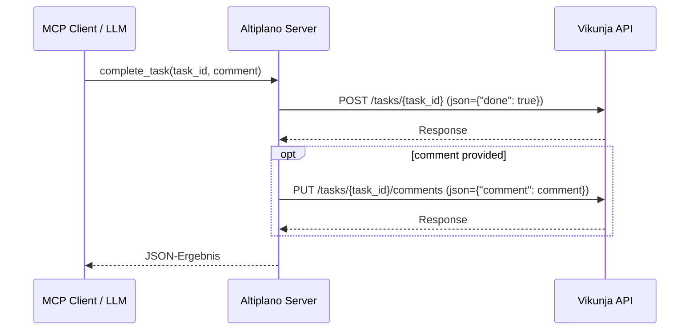
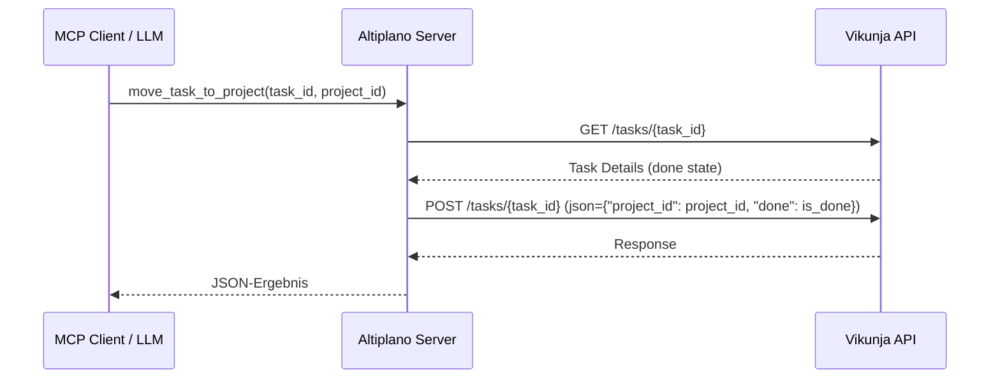

# Developer Notes: Task Security Tools

## Überblick

Technischer Zweck dieses Features ist die Implementierung von zwei MCP-Wrapper-Tools zur Absicherung von Task-Zustandsänderungen. Da LLMs bei der Verwendung von sehr flexiblen Tools wie `update_task` anfällig für unbeabsichtigtes Überschreiben oder Halluzinieren von Parametern sind, minimieren diese Wrapper den API-Payload auf das absolute Minimum.

## Referenzen

- Plan: `docs/project/features/task-security-tools/plan-v001.md`
- PRD: `docs/project/prds/vikunja-mcp-server-v004.md`

## Betroffene Dateien

| Datei | Zweck / Änderung |
|---|---|
| `src/altiplano/server.py` | Definition der MCP-Tools `complete_task` und `move_task_to_project`. |
| `tests/test_server.py` | Unit-Tests zur Verifizierung der Tool-Registrierung und Mocking-Szenarien für die API-Aufrufe. |

## Architektur und Datenfluss

Beide Tools sind in `server.py` über den `@mcp.tool()` Decorator registriert und kommunizieren über die interne Hilfsfunktion `_request` asynchron mit der Vikunja-API.





## Datenmodell und API-Mapping

- `complete_task` mappt auf `POST /tasks/{task_id}` mit Body `{"done": true}`. Bei übergebenem Kommentar wird zusätzlich `PUT /tasks/{task_id}/comments` mit `{"comment": comment}` aufgerufen.
- `move_task_to_project` mappt auf `POST /tasks/{task_id}` mit Body `{"project_id": project_id, "done": is_done}`. Der aktuelle Erledigungsstatus (`done`) wird via GET-Call zuvor geladen, um ein versehentliches Zurücksetzen des Status beim Verschieben (Vikunja Standard-Verhalten) zu verhindern.

## Validierung und Tests

| Prüfung | Ergebnis / Hinweis |
|---|---|
| `test_mcp_initialization` | Prüft, ob beide Tools korrekt im FastMCP-Server initialisiert sind. |
| `test_tool_complete_task` | Validiert den API-Aufruf für ein einfaches Erledigen. |
| `test_tool_complete_task_with_comment` | Validiert, dass bei Angabe eines Kommentars zwei sequentielle API-Requests (POST und PUT) ausgeführt werden. |
| `test_tool_move_task_to_project` | Validiert den GET-Call zur Statusabfrage und den anschließenden POST-Call zum Verschieben mit Erhalt des `done`-Werts. |

Befehl zum Ausführen der Tests:
```bash
uv run pytest
```

## Betriebs- und Setup-Hinweise

Nicht relevant.

## Wartungshinweise

- Da `move_task_to_project` nun zwei API-Requests absetzt, sollte bei Netzwerkproblemen oder Latenz-kritischen Umgebungen auf ein sauberes Connection-Timeout geachtet werden (standardmäßig in `_request` auf 30s konfiguriert).
- Vikunja neigt dazu, Zustände wie `done` bei Änderungen des Projekts zurückzusetzen. Zukünftige Ähnliche Tools (z.B. Zuweisung zu Buckets) sollten ebenfalls prüfen, ob Zustände vorab gesichert werden müssen.

## Bekannte Einschränkungen

Keine.
