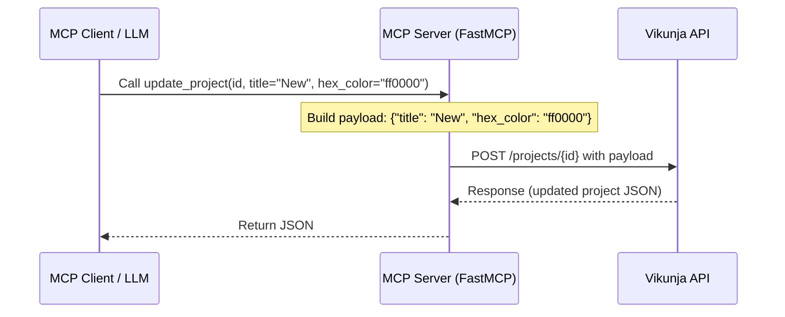

# Developer Notes: update_project Tool

## Überblick

Das `update_project` Feature fügt dem MCP-Server die Möglichkeit hinzu, bestehende Projekte in Vikunja partiell zu aktualisieren.

## Referenzen

- Plan: `docs/project/features/update-project/plan-v001.md`
- PRD: `docs/project/prds/vikunja-mcp-server-v004.md`
- Relevante Guides: `KILO_INSTRUCTIONS.md`

## Betroffene Dateien

| Datei | Zweck / Änderung |
|---|---|
| [server.py](file:///e:/bjoer/Documents/repos/altiplano/src/altiplano/server.py) | Hinzufügen des `@mcp.tool()` `update_project` und API-Request-Logik. |
| [test_server.py](file:///e:/bjoer/Documents/repos/altiplano/tests/test_server.py) | Registrierungsprüfung und Mock-Tests für `update_project`. |
| [TASKS.md](file:///e:/bjoer/Documents/repos/altiplano/TASKS.md) | Feature-Index aktualisiert. |

## Architektur und Datenfluss

Der Client ruft das MCP-Tool `update_project` mit Argumenten auf. In `server.py` wird die Payload inkrementell aus den übergebenen Argumenten (die nicht `None` sind) aufgebaut. Wenn keine Felder übergeben werden, wirft das Tool einen `ValueError`. Ansonsten wird ein asynchroner `POST`-Request auf `/projects/{project_id}` abgesetzt.



## Datenmodell und API-Mapping

Die von MCP empfangenen Argumente werden eins-zu-eins in das Vikunja-Projekt-Datenmodell übersetzt:
- `title` -> `title`
- `description` -> `description`
- `hex_color` -> `hex_color`
- `parent_project_id` -> `parent_project_id`

## Validierung und Tests

| Prüfung | Ergebnis / Hinweis |
|---|---|
| `test_mcp_initialization` | Prüft, dass `update_project` in FastMCP registriert ist. |
| `test_tool_update_project` | Mocks `_request` und verifiziert korrekte URL (`/projects/1`), Methode (`POST`) und Payload. |
| `test_tool_update_project_no_fields` | Verifiziert, dass ein `ValueError` geworfen wird, wenn keine änderbaren Felder übergeben werden. |

Befehl zum Testen:
```bash
uv run pytest
```

## Betriebs- und Setup-Hinweise

Keine neuen Umgebungsvariablen oder Konfigurationsänderungen erforderlich.

## Wartungshinweise

- Der Vikunja API-Endpunkt `POST /projects/{id}` wird für partielle Updates (PATCH-Verhalten) verwendet. Sollte Vikunja in zukünftigen API-Versionen auf `PATCH` oder ein anderes Datenformat wechseln, muss dies in `server.py` angepasst werden.
- Eine `parent_project_id` von `0` entfernt die Verschachtelung (macht es zu einem Hauptprojekt).
